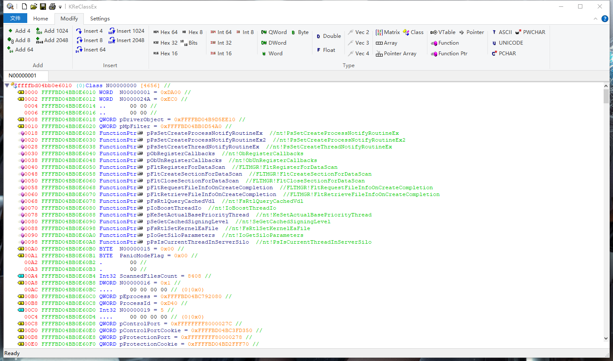

# KReClassEx

Kernel ReClassEx

The Windbg extension that implements gui to reverse struct in Windows Kernel.

## Usage

### Config the ip addr.

config.json

```json
{
  "server": "0.0.0.0",
  "server_port": "9000",
  "timeout": 300
}
```


```c
.load YourPath\KDbgEngExt.dll
!runserver YourPath\config.json
bu WdFilter!DriverEntry

.load YourPath\KDbgEngExt.dll
.unload KDbgEngExt.dll
!runserver YourPath\config.json
```

The config file should be put in the KReClassEx.exe's directory.

Connect to the Windbg.


The main UI. This example shows the WdFilter's MpData memory.


The memory view. If the node is a function pointer, Kernel ReClassEx will auto get the function name. (Sometimes you should execute the .reload to get the pdb info.)




The generate view.


### Note: 

The KReClass only read kernel memory when windbg is in break status.

# References and acknowledgement

[lexilla 5.2.6](https://github.com/ScintillaOrg/lexilla)

[scintilla 5.3.6](https://www.scintilla.org/)

[TotalPE2](https://github.com/zodiacon/TotalPE2)

[nlohmann json](https://github.com/nlohmann/json)
